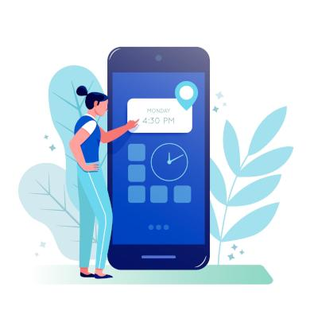

# WebPush

Lightweight Kotlin library for sending web **push notifications** with zero external dependencies.

This library by default uses blocking HTTP client provided in the JDK, but you can also use it only to
build your requests and combine it [with any HTTP library](#using-custom-http-client) that suits your needs.

## Installation

Stable releases are available in Maven Central repository.


For Gradle, add the following to your `gradle.build.kts` file:

```kotlin
dependencies {
    implementation("com.interaso:webpush:0.1.0")
}
```

For Maven, add the following to the `dependencies` block of your `pom.xml` file:

```xml
<dependency>
    <groupId>com.interaso</groupId>
    <artifactId>webpush</artifactId>
    <version>0.1.0</version>
</dependency>
```

## Usage

### Sending notifications

The process starts with initializing the [WebPushService](src/main/kotlin/com/interaso/webpush/WebPushService.kt) with
a subject (URL or `mailto:` prefixed e-mail address) and a set of VAPID keys, which are covered
[later in this document](#vapid-keys).

```kotlin
val pushService = WebPushService(
    subject = "https://example.com", // or "mailto:example@example.com"
    vapidKeys = VapidKeys.generate()
)
```

Once the service is set up, you're ready to send a push notification.

```kotlin
val subscriptionState = pushService.send(
    payload = "Example Notification",
    endpoint = subscription.endpoint, // "https://fcm.googleapis.com/fcm/send/...",
    p256dh = subscription.keys.p256dh, // "BPzdj8OB06SepRit5FpHUsaEPfs...",
    auth = subscription.keys.auth, // "hv2EhUZIbsWt8CJ...",
)
```

#### Available arguments

- `endpoint` - The URL endpoint that identifies the push service subscription.
- `p256dh` - The P256DH key for authentication with the push service provider.
- `auth` - The authentication secret for the push service provider.
- `payload` - The message payload to be sent in the push notification.
- `ttl` - The time-to-live value for the push notification (optional).
- `topic` - The topic of the push notification (optional).
- `urgency` - The urgency level of the push notification (optional).

### VAPID keys

VAPID (Voluntary Application Server Identification) keys provides a method for application servers to identify
themselves to push services. This section covers the handling of these keys with 
[VapidKeys](src/main/kotlin/com/interaso/webpush/VapidKeys.kt) class.

```kotlin
// Generate new keys
val vapidKeys = VapidKeys.generate()

// Create from Base64 encoded strings 
val vapidKeys = VapidKeys.create(
    x509PublicKey = "MIIBIjANBgkqhkiG9w0BAQEF...",
    pkcs8PrivateKey = "MIIEvQIBADANBgkqhkiG..."
)

// Load from file (line separated)
val vapidKeys = VapidKeys.load(
    path = Path("path/to/vapid.keys"),
    generateMissing = true, // If file not found, generate one and save it
)

// Get application server key for JavaScript
val applicationServerKey = vapidKeys.applicationServerKey

// Serialize to Base64 encoded strings
val publicKey = vapidKeys.x509PublicKey
val privateKey = vapidKeys.pkcs8PrivateKey
```

### Using custom HTTP client

You may prefer to use a different HTTP client for reasons of performance, suspendability, or familiarity.
The example demonstrates how to use [WebPush](src/main/kotlin/com/interaso/webpush/WebPush.kt) class to generate
request headers and the encrypted body and how to process the response.

```kotlin
// Setup request builder with subject and VAPID keys
val webPush = WebPush(subject, vapidKeys)

// Generate request headers and encrypted body
val headers = webPush.getHeaders(endpoint, ttl, topic, urgency)
val body = webPush.getBody(payload, p256dh, auth)

// Use custom HTTP client to process request
val response = customHttpClient.post(endpoint, headers, body)

// Map status code to subscription state
val subscriptionState = webPush.getSubscriptionState(response.status)
```

## Testing

In order to ensure the functionality and reliability, this library is automatically tested using local server and real
Chromium browser. For more details see [BrowserTest](src/test/kotlin/com/interaso/webpush/BrowserTest.kt) class.


## Snapshots

Development snapshots are available in the Sonatype snapshots repository. Make sure to include it in your repositories.


For Gradle, add the following to your `gradle.build.kts` file:

```kotlin
repositories {
    maven("https://s01.oss.sonatype.org/content/repositories/snapshots")
}
```

For Maven, add the following to the `repositories` block of your `pom.xml` file:

```xml
<repository>
    <id>sonatype-snapshots</id>
    <url>https://s01.oss.sonatype.org/content/repositories/snapshots</url>
    <releases>
        <enabled>false</enabled>
    </releases>
    <snapshots>
        <enabled>true</enabled>
    </snapshots>
</repository>
```

## Resources

### Specifications

- [Generic Event Delivery Using HTTP Push](https://tools.ietf.org/html/draft-ietf-webpush-protocol-11)
- [Message Encryption for Web Push](https://tools.ietf.org/html/draft-ietf-webpush-encryption-08)
- [Encrypted Content-Encoding for HTTP](https://tools.ietf.org/html/draft-ietf-httpbis-encryption-encoding-02)
- [Voluntary Application Server Identification for Web Push](https://tools.ietf.org/html/draft-ietf-webpush-vapid-01)

## Credit

This project is essentially a Kotlin adaptation of the [webpush-java](https://github.com/web-push-libs/webpush-java)
library. We extend our sincere gratitude to the original author for providing the foundation upon which this library is
built.

Illustration used in this README is by [vectorjuice](https://www.freepik.com/free-vector/attention-attraction-important-announcement-warning-information-sharing-latest-news-loudspeaker-megaphone-bullhorn-with-exclamation-mark-vector-isolated-concept-metaphor-illustration_12083537.htm#query=notification&position=10&from_view=search&track=sph) on Freepik.

## License

This project is licensed under the terms of the MIT license. See the [LICENSE](/LICENSE) file for more details.
